# css_lowcode for web

## 基于web的低代码UI开发平台
专注于UI开发，传统低代码平台的扩展模块，支持可视化css样式编辑，组件模块UI一键换肤等功能。

## 系统首页
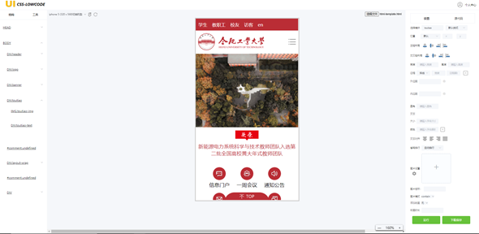

## 左侧结构树
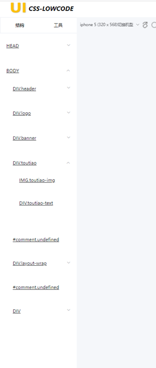

## 中间视图窗口


## 右侧编辑栏
可视化编辑css属性，定位、布局、文本、图片、边距、动画等
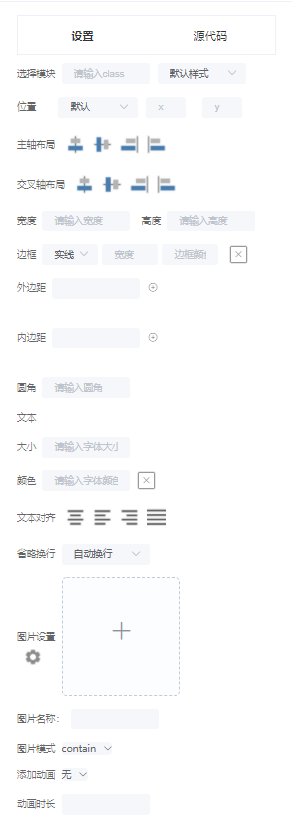

### 组件模块：针对不同业务场景，一键设置不同的UI表现
接入组件库子工程，调用组件库的不同样式UI
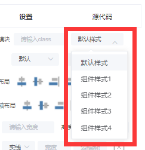

### 一键设置文本样式
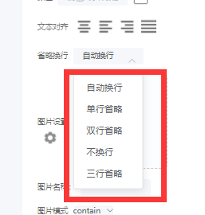

### 丰富的动画设置
使用animate.css动画库，选择动画并自动预览
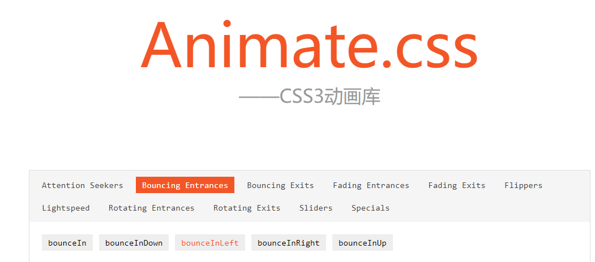

## 高级用法：支持源代码方式编辑
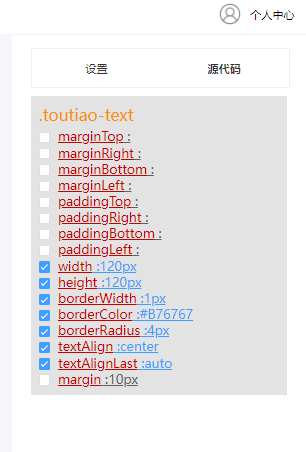

## 精细化UI：切换机型、放大缩小视图
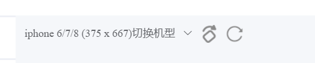
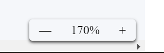

## 流程优化：设置图片并自动压缩、上传CDN
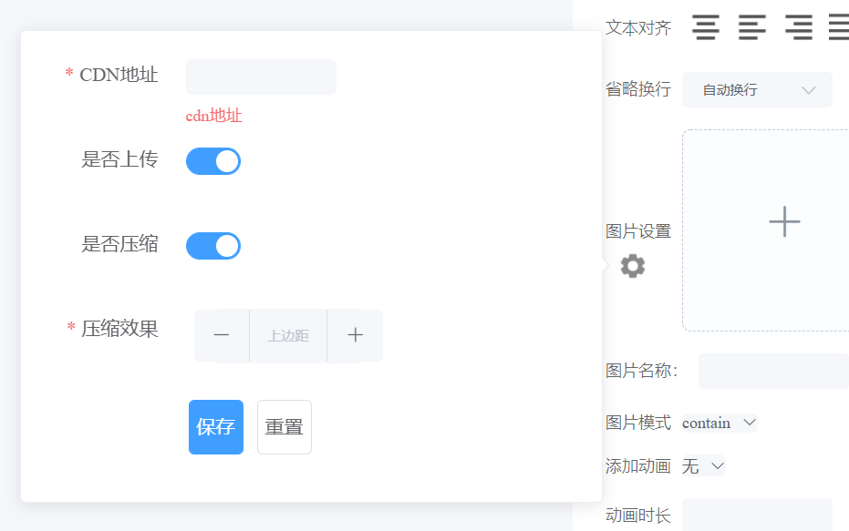

## 输出css文件，压缩模式/非压缩模式(可一键上传CDN，输出链接)
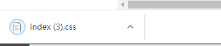

## 引用spacingjs，直观测量每个div的大小及间距
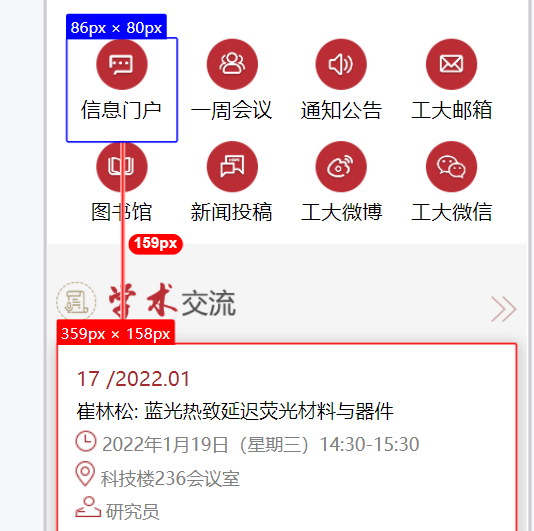
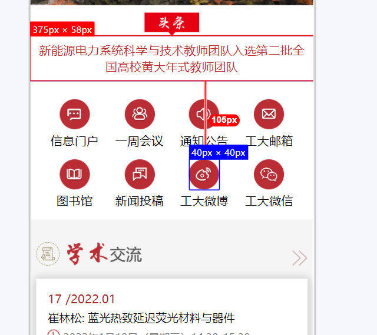


## Project setup
```
npm install
```

### Compiles and hot-reloads for development
```
npm run serve
```

### Compiles and minifies for production
```
npm run build
```

### Lints and fixes files
```
npm run lint
```